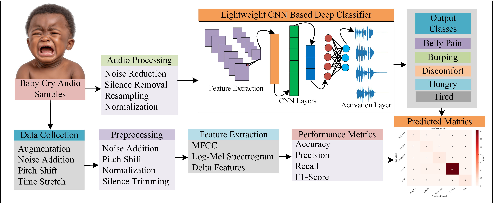

# Fast-Lightweight-CNN-for-Infant-Cry-Behavior-Recognition

> This study proposed a lightweight
Convolutional Neural Network (CNN) model to accurately recognize infant cries based on their behavioral traits.

---

## 📌 Table of Contents
- [About](#Abstract)
- [Features](#Methodology)
- [License](#Authors)
- [Contact](#contact)

---

## 📖 Abstract

Adult human beings express their feelings orally through speech, which can be clearly understood. In contrast, infants
express all their desires non-verbally through crying, using their vocal cavities, which makes it difficult for others to
easily interpret the underlying reasons for their distress. To address this challenge, this study proposed a lightweight
Convolutional Neural Network (CNN) model to accurately recognize infant cries based on their behavioral traits.
The proposed model is trained and evaluated using the Donate-Cry-Corpus dataset, which contains labeled infant
cry data for research purposes. After successfully training, the results indicate that the proposed lightweight CNN
model outperforms several existing state-of-the-art approaches. Experimental results demonstrate that the proposed
lightweight CNN model achieved 97.86% accuracy on the Donate-Cry-Corpus dataset. The proposed system aims
to assist caregivers, healthcare providers, and inexperienced parents in understanding and responding to baby cries
promptly. The development of an automated cry recognition system has the potential to improve infant care and
support the early recognition of possible health-related issues

---

# Methodology

---
# Author
Muhammad Sheraz Khan

---

📬 Contact

GitHub: Department of Electronic Engineering, Kookmin Unversity, Seoul, South Korea

Email: msherazkhan313@gmail.com
